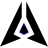

# GenLayer Spinner

A clean and lightweight animated SVG spinner/logo for GenLayer.



## Features

- Wings separate and perform one full rotation
- The core (center point) stays in place and rotates around its own center in the **opposite direction**
- Smooth and performant CSS animations
- Respects `prefers-reduced-motion`
- Uses `currentColor` so you can easily change the color with CSS
- Pure SVG – no JavaScript required

## Demo

You can see the live animation by opening `index.html` or by viewing the SVG file directly.

## Usage

### 1. As an image

```html
